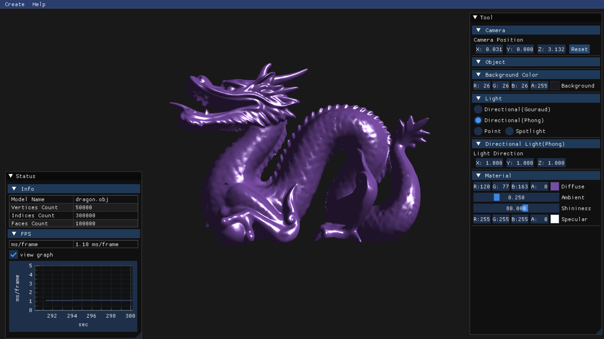

# SCOP



### 프로젝트 설명
- 블렌더와 같은 모델링 프로그램에서 제작된 3D 오브젝트를 임포트해서 보여주는 프로그램

### 사용 라이브러리
- OpenGL ES 3.0, EGL 1.5, SDL2, GLM, Assimp, ImGui

### 빌드

> macOS 환경에서 프로젝트 실행 가능

- [vcpkg](https://github.com/microsoft/vcpkg) 설치

  1. vcpkg 다운로드
    ```
    $ git clone https://github.com/microsoft/vcpkg.git
    $ ./vcpkg/bootstrap-vcpkg.sh
    ```

  2. 라이브러리 설치
    ```
    $ ./vcpkg/vcpkg install 'imgui[core,opengl3-binding,sdl2-binding]' implot assimp sdl2 glm catch2 spdlog
    ```

- SCOP 빌드
  1. SCOP 다운로드
    ```
    $ git clone https://github.com/sejinpark12/SCOP.git && cd SCOP
    ```

  2. 빌드
    ```
    $ cmake -B out -S . -DCMAKE_TOOLCHAIN_FILE=[vcpkg의 경로]/scripts/buildsystems/vcpkg.cmake
    $ cmake --build out
    ```

- 실행
    ```
    $ ./out/SCOP/SCOP
    ```

### 필수 구현 사항
1. Obj 파일 읽기
1. 3D 오브젝트는 원근투영으로 보여져야 한다.
2. 실시간으로 오브젝트에 텍스처 적용 및 해제(부드럽게 전환)
3. 오브젝트의 중심 축으로 회전

### 추가 구현 사항
1. 오목한 평면, 비공 평면 3D 오브젝트를 올바르게 렌더링

### 프로젝트 완료 후 내가 얻을 수 있는 것
1. 단순하지만 예제가 아닌 완성된 형태의 첫 번째 OpenGL 프로젝트를 만듦으로써 심화된 프로젝트를 수행하는데 밑바탕을 쌓는다.
2. .obj 파일의 사양을 이해하고 내가 제작한 프로그램에 임포트하여 원하는대로 조작할 수 있다.
3. OpenGL에서 텍스처를 다루는 법을 학습하고 오브젝트에 텍스처를 적용할 수 있다.
