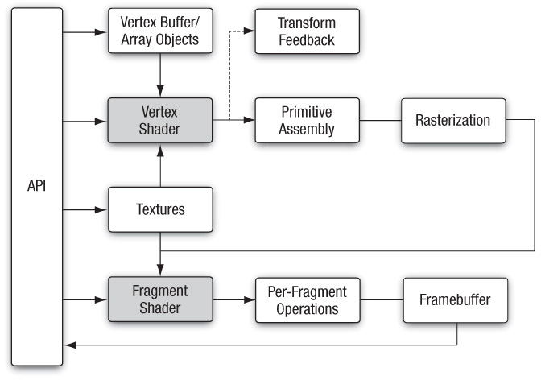

# 렌더링 파이프라인 훑어보기

지난 장에서 윈도우를 생성하여 화면에 색을 칠했습니다. 이제 간단한 도형을 그려보고 싶습니다. 하지만 그 전에 알고 넘어가야할 것이 있습니다.
화면에 원하는 물체들을 그리기 위해서는 먼저 렌더링 파이프라인에 대한 전반적인 이해가 필요합니다. 물체를 어떤 형태로 저장하고 각 파이프라인을 거치면서 어떻게 변환되고, 왜 변환하는지 알아야 그래픽스 공부를 더 즐겁게 할 수 있습니다.

위 그림은 OpenGL ES 3.0의 렌더링 파이프라인입니다. 모든 과정을 자세히 다루지는 않고 큰 흐름을 파악할 정도로만 정리를 하겠습니다. 필요한 부분은 다음에 별도의 장에서 이야기 하겠습니다.

## 렌더링 파이프라인

### 1. 버텍스 버퍼, 버텍스 어레이

렌더링하고 싶은 물체의 정점들을 렌더링 파이프라인에 전달하는 것이 렌더링 파이프라인의 시작입니다. 정점들을 Vertex Buffer와 Vertex Array에 복사하여 렌더링 파이프라인으로 보낼 수 있습니다.

### 2. 버텍스 셰이더

**버텍스 셰이더**는 렌더링 파이프라인에서 프로그래밍 가능한 단계 중 하나입니다. 버텍스 셰이더는 glsl라는 언어를 사용하여 작성합니다. 버텍스 셰이더에서는 위의 **버텍스 버퍼, 버텍스 어레이** 단계에서 보낸 물체의 정점들을 받아서 여러가지 작업들을 수행할 수 있습니다. 가장 핵심적인 작업은 **좌표 변환** 작업입니다. Vertex Buffer에 저장된 정점들은 각 물체의 로컬좌표계 상에 존재합니다. 그러므로 이 정점들에 순서대로 **모델행렬, 뷰행렬, 프로젝션행렬을 곱해서 좌표계를 클립 좌표계로 변환**시킵니다. 이렇게 하면 해당 카메라 시야의 뷰프러스텀에 물체를 위치시킬 수 있습니다.

### 3. 프리미티브 어셈블리

**프리미티브 어셈블리** 단계에서는 이전 단계에서 클립 좌표계로 변환된 정점들을 바탕으로 **프리미티브(lines, points, triangles)를 생성**합니다. 그리고 생성된 프리미티브들은 뷰프러스텀을 경계로 **클리핑**됩니다. 클리핑 단계에서 뷰프러스텀 밖에 존재하던 프리미티브 영역은 제거되고 뷰프러스텀 안쪽을 경계로 새로운 프리미티브를 생성합니다. 그 다음, 버텍스 셰이더에서 프로젝션 변환을 통해 생성된 동차좌표 w성분으로 x, y, z 성분을 나누어주는 **원근분할을 수행하여 NDC로 변환**합니다. 마지막으로 **viewport 변환을 수행하여 2차원 윈도우 좌표계로 변환**합니다. viewport 변환 시 깊이 버퍼에 z 값이 저장됩니다.

### 4. 레스터라이제이션

**레스터라이제이션** 단계에서는 프리미티브를 프레그먼트로 레스터화시킵니다. 프레그먼트는 출력 프레임 버퍼에서 픽셀에 대한 최종 데이터를 계산하는데 사용되는 상태 집합입니다.

### 5. 프레그먼트 셰이더

**레스터라이제이션** 단계에서 생성된 각 프레그먼트들은 **프레그먼트 셰이더** 단계에서 처리됩니다. 프레그먼트 셰이더는 버텍스 셰이더와 마찬가지로 프로그래밍 가능한 단계입니다. **프레그먼트 셰이더의 출력은 각 색상 버퍼에 쓰여지는 색상, 깊이값, 스텐실 값입니다.** 프레그먼트 셰이더는 프레그먼트에 대한 스텐실 데이터를 설정할 수 없지만, 색상과 깊이값을 조작할 수 있습니다.

### 6. Per-Fragment Operations

**Per-Fragment Operations** 단계는 **프레그먼트 셰이더** 단계에서 출력된 프레그먼트가 처리되고 결과 데이터가 다양한 버퍼에 기록되는 단계입니다. 프레임 버퍼의 해당 픽셀에 저장하기 전에 프레그먼트 셰이더에 의해 생성된 프레그먼트 색상을 수정할 수 있는 일련의 테스트 및 작업으로 구성됩니다. 테스트 중 하나라도 실패하면 프레그먼트가 삭제됩니다.

- 픽셀 오너쉽 테스트
  - 픽셀 오너쉽 테스트는 현재 OpenGL ES 컨텍스트가 **특정 프레그먼트에 해당하는 프레임 버퍼의 픽셀을 소유하는지 여부를 결정**합니다. 예를 들어, 렌더링하려는 윈도우가 다른 윈도우에 의해 부분적으로 가려진 경우 다른 윈도우에 의해 가려진 픽셀은 더 이상 OpenGL ES 컨텍스트의 소유가 아니므로 픽셀 오너쉽 테스트에 실패합니다.
- 시저 테스트
  - 전체 뷰포트 영역 내 **서브셋인 직사각형(시저 영역)만 렌더링**하고 싶을 때 시저 영역 내부의 프레그먼트만 테스트를 통과합니다.
- 스텐실 테스트
  - 스텐실 테스트는 **화면의 특정 영역으로 렌더링을 제한하는데 사용**됩니다(거울, 창, 포탈). 렌더링 전에 미리 스텐실 버퍼라는 프레그먼트별 정수값이 들어간 버퍼를 설정해두면 스텐실 테스트에서 비트연산합니다. 스텐실 버퍼의 내용에 따라 임의 형상에서 오려내기 조작을 할 수 있습니다.
- 깊이 테스트
  - 깊이 테스트는 정확한 폐색으로 **불투명한 프리미티브를 렌더링하는데 사용**됩니다. **깊이 버퍼 또는 Z 버퍼라고 불리는 각 프레그먼트의 깊이 정보가 담긴 버퍼를 이용**합니다. 특정 프레그먼트에 깊이 테스트를 수행하면, 이미 깊이 버퍼에 기록된 깊이와 테스트 대상 프레그먼트의 깊이를 비교하여 앞쪽에 위치한 프레그먼트의 깊이로 깊이 버퍼가 갱신되고 뒤쪽에 있는 프레그먼트는 깊이 테스를 통과하지 못합니다.
- 블렌딩
  - **프레그먼트의 색을 프레임 버퍼 안에 이미 존재하는 색과 혼합하여 반투명 프리미티브(유리, 불, 플레어 등)를 렌더링하는데 사용**됩니다. 이것은 일반적으로 반투명 프리미티브가 다른 프리미티브를 가리는 것을 피하기 위해 깊이 버퍼에 대한 쓰기를 비활성화하는 것과 같이 사용됩니다.
- 디더링
  - 디더링을 사용하여 명백한 색상 수를 늘립니다. 디더링은 일부 색상의 조합을 사용하여 다른 색상의 효과를 만드는 기술입니다.

### 7. 프레임 버퍼

최종적인 렌더링 결과가 프레임 버퍼에 저장되고 윈도우에 출력할 때 프레임 버퍼를 불러들입니다.

## 참고

- [OpenGLES - GraphicsKorea](https://github.com/GraphicsKorea/OpenGLES)
- [Chapter 8 - OpenGL ES 3.0 Programming Guide](https://www.oreilly.com/library/view/opengl-es-30/9780133440133/ch08.html#ch08fig01)
- [Rendering Pipeline Overview - OpenGL wiki](https://www.khronos.org/opengl/wiki/Rendering_Pipeline_Overview)
- [쉐이더와 Per-Fragment 이해하기](https://codingcoding.tistory.com/479)
- [투영 변환 행렬 - 상상하는게임수학](https://blog.naver.com/destiny9720/221425095052)
- [OpenGL Rendering Pipeline - songho.ca](http://www.songho.ca/opengl/gl_pipeline.html)
- [좌표계(Coordinate system)과 좌표의 의미 - 글쟁이를 꿈꾸는 검은 나비의 거실](https://m.blog.naver.com/luku756/222056517453)
- [Primitive Assembly - gomdev블로그](https://m.blog.naver.com/PostView.naver?isHttpsRedirect=true&blogId=gomdev&logNo=220111882882)
- [유니티로 배우는 게임 수학](https://www.hanbit.co.kr/store/books/look.php?p_code=B2485050358)
- [OpenGL Programming Guide - Chapter 4](http://www.glprogramming.com/red/chapter04.html)
