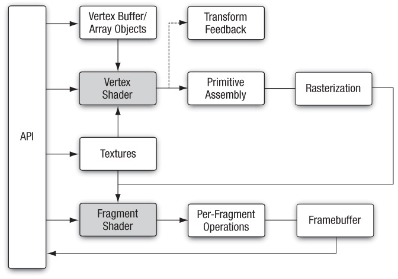

# 셰이더 다루기

지난 장에서 윈도우를 생성하여 화면에 색을 칠하는 것까지 했습니다. 이번 장에서는 간단한 도형을 그려보겠습니다.
화면에 원하는 물체들을 그리기 위해서는 먼저 렌더링 파이프라인에 대한 전반적인 이해가 필요합니다. 물체를 어떤 형태로 저장하고 각 파이프라인을 거치면서 어떻게 변환되고, 왜 변환하는지 알아야 그래픽스 공부를 더 즐겁게 할 수 있습니다.

## 렌더링 파이프라인 이해하기

위 그림은 OpenGL ES 3.0의 렌더링 파이프라인입니다. 모든 과정을 자세히 다루지는 않고 큰 흐름을 알 수 있을 정도로만 정리를 하겠습니다. 필요한 부분은 다음에 별도의 장에서 이야기 하겠습니다.
렌더링 명령을 실행하면 OpenGL ES 렌더링 파이프라인이 동작합니다.

### 1. 버텍스 버퍼, 버텍스 어레이
렌더링하고 싶은 물체의 정점들을 렌더링 파이프라인에 전달하는 것이 렌더링 파이프라인의 시작입니다. 정점들을 Vertex Buffer와 Vertex Array에 복사하여 렌더링 파이프라인으로 보낼 수 있습니다.

### 2. 버텍스 셰이더
버텍스 셰이더는 렌더링 파이프라인에서 프로그래밍 가능한 단계 중 하나입니다. 버텍스 셰이더는 glsl라는 언어를 사용하여 를 작성합니다. 버텍스 셰이더에서는 Vertex Buffer/Array Objects 단계에서 보낸 물체의 정점들을 받아서 여러가지 작업들을 수행할 수 있습니다. 가장 핵심적인 작업은 좌표 변환 작업입니다. Vertex Buffer에 저장된 정점들은 각 물체의 로컬좌표이므로 이 정점들에 모델행렬, 뷰행렬, 프로젝션행렬 순으로 곱해서 클립 좌표계로 변환시킵니다. 이렇게 하면 설정된 카메라의 시야에서 뷰프러스텀에 물체를 위치할 수 있게됩니다.

### 3. 프리미티브 어셈블리
프리미티브 어셈블리에서는 이전 단계에서 클립 좌표계로 변환된 정점들을 설정한 프리미티브(lines, points, triangles)로 만들어줍니다. 만들어진 프리미티브들은 뷰프러스텀을 경계로 클리핑됩니다. 클리핑 단계에서 뷰프러스텀 밖에 존재하던 프리미티브 영역은 제거되고 뷰프러스텀 안쪽을 경계로 새롭게 프리미티브를 만들어줍니다. 그 다음 버텍스 셰이더에서 프로젝션 변환을 통해 생성된 동차좌표 w성분으로 나누어주는 원근분할을 수행하여 NDC로 변환하고 Viewport 변환으로 2차원 윈도우 좌표계로 변환됩니다. 

### 4. 레스터라이제이션
레스터라이제이션에서는 프리미티브를 프레그먼트로 레스터화시킵니다. 프레그먼트는 출력 프레임 버퍼에서 픽셀에 대한 최종 데이터를 계산하는데 사용되는 상태 집합입니다.

### 5. 프레그먼트 셰이더
레스터라이제이션에서 생성된 각 프레그먼트들은 프레그먼트 셰이더에서 처리됩니다. 프레그먼트 셰이더는 버텍스 셰이더와 마찬가지로 프로그래밍 가능한 단계입니다. 프레그먼트 셰이더의 출력은 각 색상 버퍼에 쓰여지는 색상, 깊이값, 스텐실 값입니다. 프레그먼트 셰이더는 프레그먼트에 대한 스텐실 데이터를 설정할 수 없지만, 색상과 깊이값을 조작할 수 있습니다.

### 6. Per-Fragment Operations
- 픽셀 오너쉽 테스트
- 시저 테스트
- 스텐실 테스트
- 깊이 테스트
- 블렌딩
- 디터링

### 7. 프레임 버퍼
최종적인 렌더링 결과가 프레임 버퍼에 저장되고 윈도우에 출력할 때 프레임 버퍼를 불러들입니다.

## 셰이더 생성

## 셰이더 링킹

## 셰이더 작성

## 셰이더 삭제

## 참고
- [OpenGLES - GraphicsKorea](https://github.com/GraphicsKorea/OpenGLES)
- [Chapter 8 - OpenGL ES 3.0 Programming Guide](https://www.oreilly.com/library/view/opengl-es-30/9780133440133/ch08.html#ch08fig01)
- [Rendering Pipeline Overview - OpenGL wiki](https://www.khronos.org/opengl/wiki/Rendering_Pipeline_Overview)
- [쉐이더와 Per-Fragment 이해하기](https://codingcoding.tistory.com/479)
- [투영 변환 행렬 - 상상하는게임수학](https://blog.naver.com/destiny9720/221425095052)
- [OpenGL Rendering Pipeline - songho.ca](http://www.songho.ca/opengl/gl_pipeline.html)
- [좌표계(Coordinate system)과 좌표의 의미 - 글쟁이를 꿈꾸는 검은 나비의 거실](https://m.blog.naver.com/luku756/222056517453)
- [Primitive Assembly - gomdev블로그](https://m.blog.naver.com/PostView.naver?isHttpsRedirect=true&blogId=gomdev&logNo=220111882882)