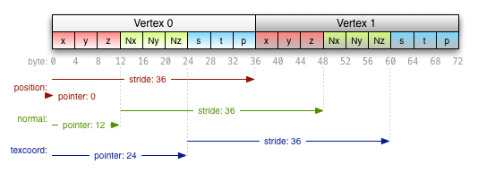

# 버텍스 버퍼 다루기
지난 장에서 셰이더를 다루는 법에 대해 이야기했습니다. 버텍스 버퍼를 사용하지 않고 셰이더 안에서 직접 삼각형 버텍스 좌표와 색상을 입력하여 삼각형을 윈도우에 그렸었는데 이번에는 실제 렌더링 파이프라인대로 버텍스 버퍼를 생성하고 버텍스 셰이더에 전달하여 삼각형을 그려보겠습니다.

## 버텍스 버퍼의 의미
**버텍스 버퍼는 CPU와 데이터를 주고받는 DRAM이나 GPU와 데이터를 주고받는 VRAM에 할당하는 메모리 공간**입니다. 이 메모리 공간에 그리고자 하는 도형의 버텍스 좌표, 색상, 텍스처좌표, 법선 등의 데이터를 저장합니다. 렌더링 파이프라인의 각 단계에서 버텍스 버퍼의 데이터에 접근하여 사용합니다.

## 버텍스 버퍼 오브젝트 생성

```c
void glGenBuffers(GLsizei n, GLuint *buffers);
```

먼저 버텍스 버퍼를 생성하기 위해서는 **버퍼 오브젝트 네임(buffer object name)** 이 필요합니다. 버퍼 오브젝트 네임은 `glGenBuffers` 함수로 생성할 수 있습니다. 첫 번째 파라미터 n는 생성할 버퍼 오브젝트 네임의 개수이고 두 번째 파라미터는 생성된 버퍼 오브젝트 네임을 반환 받을 변수의 주소입니다.

### 버퍼 오브젝트 네임
위에서 `glGenBuffers` 를 호출하면 버퍼 오브젝트 네임을 생성한다고 했습니다. 하지만 버텍스 버퍼를 생생하기 위해 버퍼 오브젝트 네임을 생성한다는 것이 잘 이해가 되지 않습니다. 여기서 새로운 용어를 조금만 더 알아보고 넘어가겠습니다. 바로 **오브젝트** 와 **네임** 입니다.

#### 오브젝트
오브젝트를 이해하기 위해서는 OpenGL ES가 **스테이트 머신** 으로 정의되어 있다는 것을 알아야합니다. OpenGL ES는 스테이트 머신이므로 여러가지 OpenGL ES API를 호출하여 OpenGL ES의 현재 상태를 **변경**하거나 **쿼리**할 수 있고, 현재 상태를 사용하여 무언가를 렌더링할 수 있습니다.
OpenGL ES 오브젝트는 **특정 상태를 저장**하고 있습니다. 어떤 오브젝트를 컨텍스트에 바인딩하면 그 오브젝트에 포함된 상태가 컨텍스트의 상태에 매핑됩니다. 그러므로 컨텍스트 상태에 대한 변경 사항은 바인딩된 오브젝트에 저장되고, 현재 컨텍스트 상태에서 동작하는 함수는 바인딩된 오브젝트에 저장된 상태를 사용합니다.
오브젝트는 언제나 상태를 담고 있습니다. 각각의 오브젝트는 담고 있는 특정 상태에 의해 정의됩니다. OpenGL ES 오브젝트는 특정 상태 그룹을 캡슐화하고 한 번의 함수 호출로 모든 상태를 변경하는 방법입니다.

#### 네임
오브젝트를 생성하기 위해서는 오브젝트 네임을 생성해야 합니다. 오브젝트 네임은 **오브젝트를 참조하는 정수형 값입니다.** `glGenBuffers` 를 호출하여 오브젝트 네임을 생성하였고 이 오브젝트 네임은 참조하고 있는 특정 오브젝트를 컨텍스트에 바인딩하여 상태를 설정할 수 있습니다.

## 버텍스 버퍼 바인딩

```c
void glBindBuffer(GLenum target, GLuint buffer);
```

`glGenBuffers` 를 호출하면 오브젝트의 참조인 오브젝트 네임만 생성됩니다. 그렇기 때문에 내부 상태를 설정하기 위해서는 오브젝트를 컨텍스트에 바인딩해야 합니다. `glBindBuffer` 를 호출하여 생성된 버퍼 오브젝트를 현재 컨텍스트에 바인딩합니다. 첫 번째 파라미터인 target은 바인딩하는 버퍼 오브젝트의 사용법을 정의합니다.

## 버텍스 버퍼 할당

```c
void glBufferData(GLenum target,
                  GLsizeiptr size,
                  const void *data,
                  GLenum usage);
```

위에서 버퍼 오브젝트를 생성하고 컨텍스트에 바인딩했습니다. 버퍼 오브젝트를 생성한 것이지 **아직 실제 버퍼를 할당하지는 않은 상태임을 주의해야 합니다.** 버퍼 오브젝트는 임의 크기의 **선형 메모리 배열**을 가지고 있습니다. 이 메모리 배열이 버퍼가 될 공간입니다. 이제 **`glBufferData` 를 호출하여 메모리에 버퍼를 할당하고 버퍼에 값을 저장**하겠습니다. 첫 번째 파라미터인 target(GL_ARRAY_BUFFER)로 바인딩된 버퍼 오브젝트에 두 번째 파라미터인 size만큼 버퍼를 할당하고 data 파라미터가 가리키는 데이터를 버퍼에 저장합니다. 마지막 파라미터인 usage는 이 버퍼에 저장된 데이터의 사용 방식을 지정합니다. 현재 예제에서는 간단한 삼각형을 렌더링하는 것이므로 `GL_STATIC_DRAW` 를 파라미터로 지정합니다. 하지만 만약 버텍스의 값이 빈번하게 바뀌는 모델을 렌더링한다면 버텍스 버퍼를 할당할 때 `GL_DYNAMIC_DRAW` 로 설정해야 성능 상 유리합니다.

## 버텍스 셰이더에 버텍스 버퍼 전달

이제 드디어 이번 장의 목표였던 버텍스 셰이더에 버텍스 버퍼를 전달하여 삼각형을 렌더링 해보겠습니다. 그 전에 지금까지 완료한 작업들을 정리해보겠습니다.
1. 버텍스 버퍼 오브젝트를 생성했습니다.
2. 버텍스 버퍼 오브젝트를 컨텍스트에 바인딩했습니다.
3. 바인딩된 버텍스 버퍼 오브젝트에서 버퍼를 할당하고 데이터를 저장했습니다.

그 다음 작업은 무엇일까요? 버텍스 버퍼에 값이 저장됐다고 해서 **버텍스 셰이더에서 버텍스 버퍼에 저장된 여러가지 데이터들을 바로 접근하여 사용할 수는 없습니다.** 버텍스 셰이더가 버텍스 버퍼의 데이터에 접근하기 위해서는 **버텍스 어트리뷰트 데이터의 배열을 정의해주어야 합니다.**


위 그림은 이전 장에서 보았던 버텍스 셰이더의 입출력 데이터들에 대한 그림입니다. 여기서 왼쪽에 **`Input(Attribute) 1 ~ N` 으로 들어오는 데이터가 버텍스 어트리뷰트 데이터 배열**입니다.

```c
void glEnableVertexAttribArray(GLuint index);
```

버텍스 어트리뷰트 배열은 **비활성화 상태로 초기화**되어 있습니다. 따라서 버텍스 셰이더에서 원하는 인덱스의 버텍스 어트리뷰트를 사용하기 위해서는 `glEnableVertexAttribArray` 로 **해당 인덱스를 활성화**시켜줘야 합니다.

```c
void glVertexAttribPointer(GLuint index,
                          GLint size,
                          GLenum type,
                          GLboolean normalized,
                          GLsizei stride,
                          const void *pointer);
```

`glVertexAttribPointer` 는 **버텍스 어트리뷰트 배열의 location과 데이터 형식을 지정합니다.** 잘 이해가 되지 않을 것 같아서 다시 풀어서 설명을 해보겠습니다. 첫 번째 파라미터 index는 위 그림의 `Input(Attribute) 1 ~ N` 의 인덱스와 연결됩니다. 그리고 나머지 파라미터들은 버텍스 버퍼에 들어있는 데이터의 형식을 지정하는 것입니다.

- `index` : 설정할 버텍스 어트리뷰트 배열의 인덱스입니다.
- `size` : 버텍스 어트리뷰트 당 원소의 수입니다.
- `type` : 원소의 데이터 타입입니다.
- `normalized` : GL_TRUE로 설정된 경우, 정수 형식으로 저장된 값이 [-1, 1](signed 값의 경우) 또는 [0, 1](unsigned 값의 경우) 범위로 매핑되어 부동 소수점으로 변환됩니다. GL_FALSE로 설정된 경우, 정규화 없이 부동 소수점으로 변환됩니다.
- `stride` : 버텍스 버퍼의 연속적인 메모리에 저장된 데이터 중 해당 버텍스 어트리뷰트로 설정할 데이터들 사이의 폭입니다. 만약 데이터들이 빈틈없이 들어차있다면(tightly packed) 0으로 설정할 수 있습니다. 그렇게 되면 OpenGL ES에서 stride를 자동으로 계산합니다.
- `pointer` : 버텍스 버퍼의 시작지점에서 해당 버텍스 어트리뷰트로 설정할 데이터가 얼만큼 떨어져 있는지 나타내는 오프셋입니다. 



## 버텍스 버퍼 파괴

```c
void glDeleteBuffers(GLsizei n, const GLuint *buffers);
```

버텍스 버퍼를 사용하여 렌더링을 수행한 후 프로그램을 종료할 때, 생성했던 버텍스 버퍼 오브젝트를 파괴해주어야 합니다. `glDeleteBuffers` 를 호출하면 파라미터로 지정한 **버퍼 오브젝트가 파괴**되고 해당 버퍼 오브젝트를 참조하던 **오브젝트 네임도 초기화** 됩니다.

## 삼각형 그리기

[코드](https://github.com/GraphicsKorea/OpenGLES/blob/main/14.SetAttribute/src/main.cpp)

```c
// /14.SetAttribute/src/main.cpp

...

int main([[maybe_unused]] int argc, [[maybe_unused]] char *argv[]) {
    ...

    window.run([&app, &window] {
        startup(app, window);

        // 버텍스 버퍼 오브젝트 네임 생성
        GL_TEST(glGenBuffers(1, &app.buffer));
        // 버텍스 버퍼 오브젝트 바인딩
        GL_TEST(glBindBuffer(GL_ARRAY_BUFFER, app.buffer));

        // 삼각형 버텍스와 색상 초기화
        const std::array<Vertex, 3> vertices = {
            Vertex{{-0.5f, -0.5f,  0.0f},
                   { 1.0f,  0.0f,  0.0f}},
            Vertex{{ 0.5f, -0.5f,  0.0f},
                   { 0.0f,  1.0f,  0.0f}},
            Vertex{{ 0.0f,  0.5f,  0.0f},
                   { 0.0f,  0.0f,  1.0f}}
        };        
        // 버텍스 버퍼 할당
        GL_TEST(glBufferData(GL_ARRAY_BUFFER, byte_size(vertices), vertices.data(), GL_STATIC_DRAW));
        // 버텍스 버퍼 오브젝트 바인딩 해제
        GL_TEST(glBindBuffer(GL_ARRAY_BUFFER, 0));

        app.program = create_graphics_pipeline({home() / "14.SetAttribute/res/triangle.vert",
                                                home() / "14.SetAttribute/res/unlit.frag"});        
    },
    [] {},
    [&app, &window] {
        ...

        // 버텍스 버퍼 오브젝트 바인딩
        GL_TEST(glBindBuffer(GL_ARRAY_BUFFER, &app.buffer));

        // 버텍스 어트리뷰트 배열 활성화
        GL_TEST(glEnableVertexAttribArray(0));
        GL_TEST(glEnableVertexAttribArray(1));
        // 버텍스 어트리뷰트 속성 설정
        GL_TEST(glVertexAttribPointer(0, 3, GL_FLOAT, GL_FALSE, sizeof(Vertex), GL_OFFSETOF(Vertex, position)));
        GL_TEST(glVertexAttribPointer(1, 3, GL_FLOAT, GL_FALSE, sizeof(Vertex), GL_OFFSETOF(Vertex, color)));
        // 버텍스 어트리뷰트 배열을 사용하여 렌더링
        GL_TEST(glDrawArrays(GL_TRIANGLES, 0, 3));
        // 버텍스 어트리뷰트 배열 비활성화
        GL_TEST(glDisableVertexAttribArray(1));
        GL_TEST(glDisableVertexAttribArray(0));
        
        GL_TEST(glUseProgram(0));
        // 버텍스 버퍼 오브젝트 바인딩 해제
        GL_TEST(glBindBuffer(GL_ARRAY_BUFFER, 0));

        EGL_TEST(eglSwapBuffers(app.display, app.surface));
    },
    [&app] {
        GL_TEST(glDeleteProgram(app.program));
        app.program = 0;

        // 버텍스 버퍼 파괴
        GL_TEST(glDeleteBuffers(1, &app.buffer));
        app.buffer = 0;

        shutdown(app);
    });

    return 0;
}

```

## 결과


## 참고

- [OpenGLES - GraphicsKorea](https://github.com/GraphicsKorea/OpenGLES)
- [Hello Triangle - Learn OpenGL](https://learnopengl.com/Getting-started/Hello-Triangle)
- [OpenGL Object - OpenGL Wiki](https://www.khronos.org/opengl/wiki/OpenGL_Object)
- [Buffer Object - OpenGL Wiki](https://www.khronos.org/opengl/wiki/Buffer_Object)
- [Vertex Specification - OpenGL Wiki](https://www.khronos.org/opengl/wiki/Vertex_Specification#Vertex_Buffer_Object)
- [OpenGL Context - OpenGL Wiki](https://www.khronos.org/opengl/wiki/OpenGL_Context)
- [OpenGL ES Documentation](https://registry.khronos.org/OpenGL-Refpages/es3.0/)
- [Following the Data - Learning Modern 3D Graphics Programming](https://nicolbolas.github.io/oldtut/Basics/Tut01%20Following%20the%20Data.html)
- [Rendering fails completely when nonzero stride is used in glVertexAttribPointer - Stack Overflow](https://stackoverflow.com/questions/18228983/rendering-fails-completely-when-nonzero-stride-is-used-in-glvertexattribpointer)
- [OpenGL ES iOS Attribute issues - Stack Overflow](https://stackoverflow.com/questions/18627902/opengl-es-ios-attribute-issues)