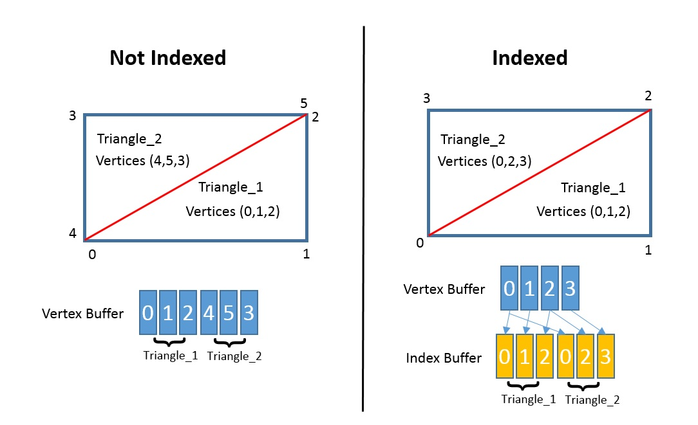
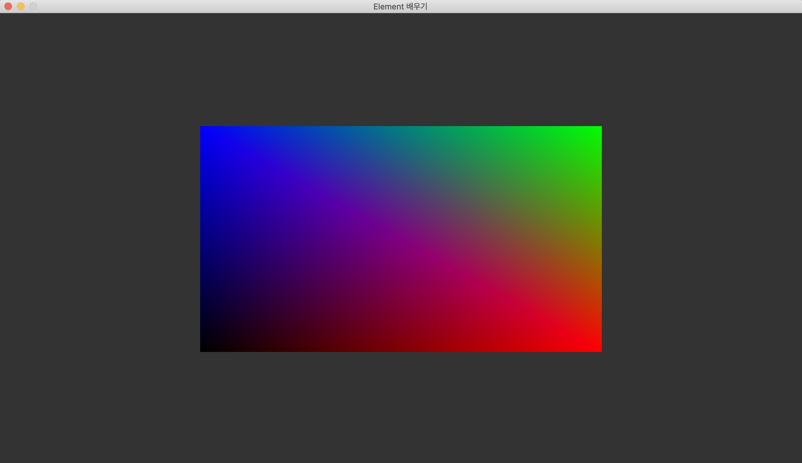

# 인덱스 버퍼와 버텍스 어레이 다루기
이전 장에서 버텍스 버퍼를 사용하여 삼각형을 렌더링했습니다. 이번 장에서는 새로운 개념인 **인덱스 버퍼**를 사용하여 사각형을 렌더링해보겠습니다. 사각형을 그릴 때 인덱스 버퍼를 사용하는 목적과 인덱스 버퍼를 사용하는 방법에 대해 알아보겠습니다.
그 다음은 **버텍스 어레이**를 다루어 보겠습니다. 화면을 렌더링할 때 동일한 오브젝트의 상태를 매 프레임마다 설정하는 것은 불필요한 OpenGL ES 함수호출을 발생시켜서 CPU 자원이 낭비됩니다. 버텍스 어레이에 오브젝트의 상태를 처음 한 번만 저장하고 렌더링할 때마다 상태를 한번에 불러와서 OpenGL ES 함수호출을 절약할 수 있습니다. 인덱스 버퍼 예제와 마찬가지로 사용하는 목적과 버텍스 어레이를 사용하는 방법에 대해 알아보겠습니다.

## 인덱스 버퍼의 의미



프리미티브를 `GL_TRIANGLES`로 설정하여 사각형을 그린다고 가정하겠습니다. 그럼 왼쪽 그림과 같이 삼각형 2개를 이어붙혀서 사각형을 그립니다. 이때 삼각형이 이어지는 부분에서 2개의 버텍스가 겹쳐집니다(5번 버텍스 = 2번 버텍스, 4번 버텍스 = 0번 버텍스). 따라서 버텍스 버퍼만을 사용해서 사각형을 그린다면 **동일한 버텍스 데이터가 버텍스 버퍼에 두 번 저장되므로 메모리 공간이 낭비됩니다.**

오른쪽 그림은 인덱스 버퍼를 사용하여 사각형을 그린 것입니다. 왼쪽 그림의 버텍스 버퍼와 다르게 버텍스 버퍼에 저장된 버텍스들이 중복되지 않습니다. 버텍스 버퍼는 선형의 메모리 배열이므로 **버텍스 버퍼 윈소인 버텍스의 인덱스가 존재합니다.** 버텍스 버퍼에 저장된 삼각형을 구성하는 버텍스들의 인덱스들끼리 차례로 인덱스 버퍼에 저장합니다. 그러면 이 인덱스들로 버텍스 버퍼의 버텍스를 특정할 수 있으므로 원하는 삼각형을 그릴 수 있습니다. 

## 인덱스 버퍼 오브젝트 생성

```c
void glGenBuffers(GLsizei n, GLuint *buffers);
```

버텍스 버퍼를 생성할 때와 마찬가지로 **인덱스 버퍼를 생성하기 위해서는 버퍼 오브젝트 네임이 필요합니다.** 

## 인덱스 버퍼 바인딩

```c
void glBindBuffer(GLenum target, GLuint buffer);
```

버텍스 버퍼 바인딩과 마찬가지로 생성한 버퍼 오브젝트를 컨텍스트에 바인딩해야 합니다.
여기서 버텍스 버퍼 바인딩과 다른점은 target입니다. 인덱스 버퍼 바인딩의 target은 GL_ELEMENT_ARRAY_BUFFER 입니다.

## 인덱스 버퍼 할당

버텍스 버퍼 할당과 마찬가지로 이제 `glBufferData` 를 호출하여 메모리에 버퍼를 할당하고 버퍼에 값을 저장하겠습니다. 컨택스트의 현재 target에 바인딩된 버퍼 오브젝트에 대한 버퍼(GL_ELEMENT_ARRAY_BUFFER)를 두 번째 파라미터인 size만큼 할당하고 data 파라미터가 가리키는 데이터를 버퍼에 저장합니다. 마지막 파라미터인 usage는 이 버퍼에 저장된 데이터의 사용 방식을 지정합니다. 현재 예제에서는 간단한 삼각형을 렌더링하는 것이므로 `GL_STATIC_DRAW` 를 파라미터로 지정합니다. 하지만 만약 버텍스의 값이 빈번하게 바뀌는 모델을 렌더링한다면 버텍스 버퍼를 할당할 때 `GL_DYNAMIC_DRAW` 로 설정해야 성능 상 유리합니다.

## 인덱스 버퍼 파괴

```c
void glDeleteBuffers(GLsizei n, const GLuint *buffers);
```

버텍스 버퍼와 마찬가지로 인덱스 버퍼를 사용하여 렌더링을 수행한 후 프로그램을 종료할 때, 생성했던 인덱스 버퍼 오브젝트를 파괴해주어야 합니다. `glDeleteBuffers` 를 호출하면 파라미터로 지정한 **버퍼 오브젝트가 파괴**되고 해당 버퍼 오브젝트를 참조하던 **오브젝트 네임도 초기화** 됩니다.

## glDrawElements 함수호출
버텍스 버퍼만 사용해서 렌더링할 때는 `glDrawArrays` 를 호출했습니다. 하지만 인덱스 버퍼를 사용해서 렌더링할 때는 `glDrawElements` 를 호출합니다.

```c
void glDrawElements(GLenum mode, GLsizei count, GLenum type, const void *indices);
```

첫 번째 파라미터는 `glDrawArrays` 와 마찬가지로 렌더링할 프리미티브의 종류를 지정합니다. 두 번째 파라미터는 렌더링할 인덱스의 갯수입니다. 세 번째 파라미터는 인덱스의 데이터 타입입니다. 네 번째 파라미터는 인덱스 버퍼의 오프셋입니다.


## 삼각형 그리기

[코드](https://github.com/GraphicsKorea/OpenGLES/blob/main/15.LearnElement/src/main.cpp)

```c
// /15.LearnElement/src/main.cpp

...

int main([[maybe_unused]] int argc, [[maybe_unused]] char *argv[]) {
    ...

    window.run([&app, &window] {
        startup(app, window);

        // 버텍스 버퍼 오브젝트 네임 생성
        GL_TEST(glGenBuffers(1, &app.vertex_buffer));
        // 버텍스 버퍼 오브젝트를 컨텍스트에 바인딩
        GL_TEST(glBindBuffer(GL_ARRAY_BUFFER, app.vertex_buffer));

        // 사각형 버텍스와 색상을 담은 vertices array 컨테이너 초기화
        constexpr std::array<Vertex, 4> vertices = {
            Vertex{{-0.5f,-0.5f, 0.0f},
                   { 0.0f, 0.0f, 0.0f}},
            Vertex{{ 0.5f,-0.5f, 0.0f},
                   { 1.0f, 0.0f, 0.0f}},
            Vertex{{ 0.5f, 0.5f, 0.0f},
                   { 0.0f, 1.0f, 0.0f}},
            Vertex{{-0.5f, 0.5f, 0.0f},
                   { 0.0f, 0.0f, 1.0f}}            
        };

        // 버텍스 버퍼 할당
        GL_TEST(glBufferData(GL_ARRAY_BUFFER, byte_size(vertices), vertices.data(), GL_STATIC_DRAW));
        // 버텍스 버퍼 오브젝트 바인딩 해제
        GL_TEST(glBindBuffer(GL_ARRAY_BUFFER, 0));

        // 인덱스 버퍼 오브젝트 네임 생성
        GL_TEST(glGenBuffers(1, &app.index_buffer));
        // 인덱스 버퍼 오브젝트를 컨텍스트에 바인딩
        GL_TEST(glBindBuffer(GL_ELEMENT_ARRAY_BUFFER, app.index_buffer));

        // 사각형 인덱스를 담은 indices array 컨테이너 초기화
        constexpr std::array<uint16_t, 6> indices = {
            0, 1, 3, 2, 3, 1
        };

        // 인덱스 버퍼 할당
        GL_TEST(glBufferData(GL_ELEMENT_ARRAY_BUFFER, byte_size(indices), indices.data(), GL_STATIC_DRAW));
        // 인덱스 버퍼 오브젝트 바인딩 해제
        GL_TEST(glBindBuffer(GL_ELEMENT_ARRAY_BUFFER, 0));

        ...
    },
    [] {},
    [&app, &window] {
        ...

        // 버텍스 버퍼 오브젝트 바인딩
        GL_TEST(glBindBuffer(GL_ARRAY_BUFFER, app.vertex_buffer));
        // 버텍스 어트리뷰트 배열 활성화
        GL_TEST(glEnableVertexAttribArray(0));
        GL_TEST(glEnableVertexAttribArray(1));
        // 버텍스 어트리뷰트 속성 설정
        GL_TEST(glVertexAttribPointer(0, 3, GL_FLOAT, GL_FALSE, sizeof(Vertex), GL_OFFSETOF(Vertex, position)));
        GL_TEST(glVertexAttribPointer(1, 3, GL_FLOAT, GL_FALSE, sizeof(Vertex), GL_OFFSETOF(Vertex, color)));
        // 인덱스 버퍼 오브젝트 바인딩
        GL_TEST(glBindBuffer(GL_ELEMENT_ARRAY_BUFFER, app.index_buffer));
        // 인덱스를 사용하여 렌더링
        GL_TEST(glDrawElements(GL_TRIANGLES, 6, GL_UNSIGNED_SHORT, nullptr));
        // 버텍스 어트리뷰트 배열 비활성화
        GL_TEST(glDisableVertexAttribArray(1));
        GL_TEST(glDisableVertexAttribArray(0));
        // 버텍스 버퍼 오브젝트 바인딩 해제
        GL_TEST(glBindBuffer(GL_ARRAY_BUFFER, 0));
        // 인덱스 버퍼 오브젝트 바인딩 해제
        GL_TEST(glBindBuffer(GL_ELEMENT_ARRAY_BUFFER, 0));

        ...
    },
    [&app] {
        GL_TEST(glDeleteProgram(app.program));
        app.program = 0;

        // 버텍스 버퍼 파괴
        GL_TEST(glDeleteBuffers(1, &app.vertex_buffer));
        app.vertex_buffer = 0;

        // 인덱스 버퍼 파괴
        GL_TEST(glDeleteBuffers(1, &app.index_buffer));
        app.index_buffer = 0;

        shutdown(app);
    });

    return 0;
}
```

## 결과



## 버텍스 어레이의 의미
버텍스 어레이의 목적 : cpu 최적화

## 버텍스 어레이 오브젝트 생성

## 버텍스 어레이 바인딩

## 버텍스 어레이 파괴

## 삼각형 그리기

## 결과

## 참고

- [OpenGLES - GraphicsKorea](https://github.com/GraphicsKorea/OpenGLES)
- [GLSL / OpenGL Reusing output from vertex shader - Stack Overflow](https://stackoverflow.com/questions/32337658/glsl-opengl-reusing-output-from-vertex-shader)
- [glDrawElements - OpenGL ES 3.0 Reference Page](https://registry.khronos.org/OpenGL-Refpages/es3.0/html/glDrawArrays.xhtml)