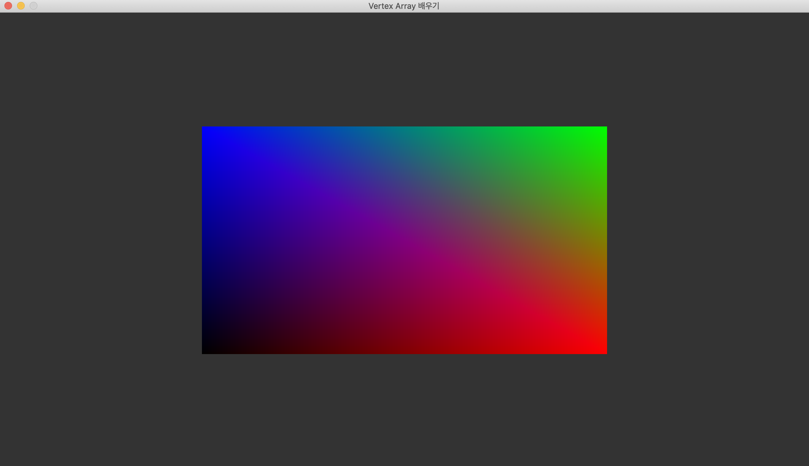

# 버텍스 어레이 다루기
그 다음은 **버텍스 어레이**를 다루어 보겠습니다. 화면을 렌더링할 때 동일한 오브젝트의 상태를 매 프레임마다 설정하면 OpenGL ES 함수를 불필요하게 많이 호출해서 CPU 자원이 낭비됩니다. 버텍스 어레이에 처음 한 번만 오브젝트의 상태를 저장하고 렌더링할 때마다 버텍스 어레이로부터 오브젝트의 모든 상태를 한번에 불러와서 OpenGL ES 함수호출을 줄일 수 있습니다. 그 결과 CPU의 연산을 최적화 할 수 있습니다. 인덱스 버퍼 예제와 마찬가지로 사용하는 목적과 버텍스 어레이를 사용하는 방법에 대해 알아보겠습니다.

## 버텍스 어레이의 의미
버텍스 어레이 오브젝트(Vertex Array Object)는 버텍스 데이터를 제공하는 데 필요한 모든 상태를 저장하는 OpenGL ES 오브젝트입니다. **버텍스 데이터의 포맷과 버텍스 데이터 배열을 제공하는 버퍼 오브젝트들을 저장합니다.** 버텍스 어레이 오브젝트는 버퍼를 참조할 뿐, 버퍼를 복사하거나 가지고 있지 않습니다.

버퍼 오브젝트와 마찬가지로 생성, 바인딩, 파괴 함수를 가집니다.

## 버텍스 어레이 오브젝트 생성

```c
void glGenVertexArrays(GLsizei n, GLuint *arrays);
```

버퍼 오브젝트와 마찬가지로 버텍스 어레이 오브젝트 네임을 먼저 생성해야 합니다. `glGenVertexAarrays` 를 호출하여 버텍스 어레이 오브젝트 네임을 생성합니다. 첫 번째 파라미터는 생성할 버텍스 어레이 오브젝트 네임의 개수이고 두 번째 파라미터는 생성된 버텍스 어레이 오브젝트 네임을 반환 받을 변수의 주소입니다.

## 버텍스 어레이 바인딩

```c
void glBindVertexArray(GLuint array);
```

버퍼 오브젝트와 마찬가지로 생성한 버텍스 어레이 오브젝트를 컨텍스트에 바인딩해야 합니다.`glBindVertexArray` 를 호출하여 버텍스 어레이 오브젝트를 컨텍스트에 바인딩합니다.

## 버텍스 어레이를 사용하여 상태 저장
버텍스 어레이를 바인딩한 뒤, 그 다음부터 설정하는 모든 상태는 버텍스 어레이의 상태에 저장됩니다.
버텍스 어레이에 저장되는 상태는 다음과 같습니다.

```c
void glBindBuffer(...);
void glEnableVertexAttribArray(...);
void glDisableVertexAttribArray(...);
void glVertexAttribPointer(...);
```

새로 생성된 버텍스 어레이 오브젝트는 모든 어트리뷰트에 대해 엑세스가 비활성화 되어 있습니다.

## 버텍스 어레이 파괴

```c
void glDeleteVertexArrays(GLsizei n, const GLuint *arrays);
```

버퍼 오브젝트와 마찬가지로 렌더링을 수행한 후 프로그램을 종료할 때, 생성했던 버텍스 어레이 오브젝트를 파괴해줍니다. `glDeleteVertexArrays` 를 호출하여 버텍스 어레이 오브젝트를 파괴하고 해당 버텍스 어레이 오브젝트를 참조하던 오브젝트 네임을 초기화 합니다.

## 삼각형 그리기

[코드](https://github.com/GraphicsKorea/OpenGLES/blob/main/16.LearnVertexArray/src/main.cpp)

```c
// /16.LearnVertexArray/src/main.cpp

...

int main([[maybe_unused]] int argc, [[maybe_unused]] char *argv[]) {
    ...

    window.run([&app, &window] {
        startup(app, window);

        GL_TEST(glGenBuffers(1, &app.vertex_buffer));
        GL_TEST(glBindBuffer(GL_ARRAY_BUFFER, app.vertex_buffer));
        constexpr std::array<Vertex, 4> vertices = {
            Vertex{{-0.5f,-0.5f, 0.0f},
                   { 0.0f, 0.0f, 0.0f}},
            Vertex{{ 0.5f,-0.5f, 0.0f},
                   { 1.0f, 0.0f, 0.0f}},
            Vertex{{ 0.5f, 0.5f, 0.0f},
                   { 0.0f, 1.0f, 0.0f}},
            Vertex{{-0.5f, 0.5f, 0.0f},
                   { 0.0f, 0.0f, 1.0f}}
        };
        GL_TEST(glBufferData(GL_ARRAY_BUFFER, byte_size(vertices), vertices.data(), GL_STATIC_DRAW));
        GL_TEST(glBindBuffer(GL_ARRAY_BUFFER, 0));

        GL_TEST(glGenBuffers(1, &app.index_buffer));
        GL_TEST(glBindBuffer(GL_ELEMENT_ARRAY_BUFFER, app.index_buffer));
        constexpr std::array<uint16_t, 6> indices = {
            0, 1, 3, 2, 3, 1
        };
        GL_TEST(glBufferData(GL_ELEMENT_ARRAY_BUFFER, byte_size(indices), indices.data(), GL_STATIC_DRAW));
        GL_TEST(glBindBuffer(GL_ELEMENT_ARRAY_BUFFER, 0));

        // 버텍스 어레이 오브젝트 생성
        GL_TEST(glGenVertexArrays(1, &app.vertex_array));
        // 버텍스 어레이 오브젝트 바인딩
        GL_TEST(glBindVertexArray(app.vertex_array));
        // 버텍스 어레이를 바인딩 한 다음부터 설정한 오브젝트의 상태들이 버텍스 어레이에 저장
        GL_TEST(glBindBuffer(GL_ARRAY_BUFFER, app.vertex_buffer));
        GL_TEST(glBindBuffer(GL_ELEMENT_ARRAY_BUFFER, app.index_buffer));
        GL_TEST(glEnableVertexAttribArray(0));
        GL_TEST(glEnableVertexAttribArray(1));
        GL_TEST(glVertexAttribPointer(0, 3, GL_FLOAT, GL_FALSE, sizeof(Vertex), GL_OFFSETOF(Vertex, position)));
        GL_TEST(glVertexAttribPointer(1, 3, GL_FLOAT, GL_FALSE, sizeof(Vertex), GL_OFFSETOF(Vertex, color)));
        // 버텍스 어레이 오브젝트 바인딩 해제
        GL_TEST(glBindVertexArray(0));

        ...

    },
    [] {},
    [&app, &window] {
        ...
        // 버텍스 어레이 오브젝트 바인딩
        GL_TEST(glBindVertexArray(app.vertex_array));
        // 이전 장에서 렌더링할 때마다 OpenGL ES 함수들을 여러개 호출하여 오브젝트의 상태를 설정해주었지만
        // 버텍스 어레이를 사용하여 바인드 함수호출 하나로 오브젝트의 상태를 한번에 설정할 수 있음
        GL_TEST(glDrawElements(GL_TRIANGLES, 6, GL_UNSIGNED_SHORT, nullptr));
        GL_TEST(glBindVertexArray(0));

        ...
    },
    [&app] {
        GL_TEST(glDeleteProgram(app.program));
        app.program = 0;

        GL_TEST(glDeleteVertexArrays(1, &app.vertex_array));
        app.vertex_array = 0;

        GL_TEST(glDeleteBuffers(1, &app.vertex_buffer));
        app.vertex_buffer = 0;

        GL_TEST(glDeleteBuffers(1, &app.index_buffer));
        app.index_buffer = 0;

        shutdown(app);
    });

    return 0;
}

```

## 결과



## 참고

- [OpenGLES - GraphicsKorea](https://github.com/GraphicsKorea/OpenGLES)
- [Vertex Array Object - OpenGL Wiki](https://www.khronos.org/opengl/wiki/Vertex_Specification#Vertex_Array_Object)