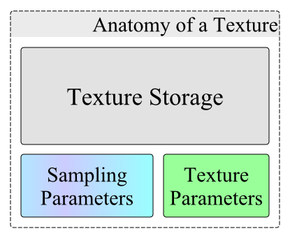

# 텍스처 입히기

## 텍스처의 필요성
이전 장까지는 삼각형이나 사각형을 렌더링할 때, 각 버텍스마다 색상을 지정해서 도형에 색을 칠했습니다. 하지만 복잡하고 정교한 표면을 렌더링하고 싶은 경우에 모든 버텍스에 색상을 지정해서 렌더링한다면 매우 힘든작업이 될 것입니다. 이러한 문제를 효율적으로 해결하기 위해서 텍스처를 사용합니다.

## 텍스처의 의미

버텍스 버퍼와 마찬가지로 텍스처도 셰이더에서 사용할 수 있는 자원 중에 하나입니다.

### 텍스처의 사용법

텍스처는 동일한 포맷의 이미지를 하나 이상 가지고 있는 OpenGL ES 오브젝트입니다.
텍스처는 아래의 두 가지 방식으로 사용할 수 있습니다.

1. 셰이더에서 텍스처에 접근하여 사용.
2. 렌더 타겟으로 사용.

### 텍스처의 제약조건

위에서 텍스처는 하나 이상의 이미지가 담긴 컨테이너라고 했습니다. 하지만 텍스처가 임의의 이미지를 저장하지는 않습니다. 텍스처에는 저장할 수 있는 이미지에 대한 세 가지 제약 조건이 존재합니다.

1. 텍스처 타입 : 텍스처에서 이미지의 배열을 정의
2. 텍스처 사이즈 : 텍스처에서 이미지의 크기를 정의
3. 이미지 포멧 : 이러한 모든 이미지가 공유하는 포멧을 정의



## 텍스처 오브젝트 생성

```c
void glGenTextures(GLsizei n, GLuint *textures);
```

이전의 다른 오브젝트들과 마찬가지로 텍스처도 `glGenTextures` 함수를 호출하여 텍스처 오브젝트를 생성합니다.

## 텍스처 바인딩

```c
void glBindTexture(GLenum target, GLuint texture);
```

이전의 다른 오브젝트들과 마찬가지로 텍스처도 `glBindTexture` 함수를 호출하여 텍스처 오브젝트를 바인딩합니다.

## 텍스처 할당

```c
void glTexImage2D(GLenum target,
                  GLint level,
                  GLint internalFormat,
                  GLsizei width,
                  GLsizei height,
                  GLint border,
                  GLenum format,
                  GLenum type,
                  const void *data);
```

`glTexImage2D`를 호출하여 셰이더에서 사용할 텍스처를 할당합니다.

첫 번째 파라미터인 target은 할당하고자 하는 텍스처 오브젝트가 바인딩된 target으로 지정해줍니다.
두 번째 파라미터인 level은 밉맵에 관련된 파라미터이고 여기서는 사용하지 않을 것이기 때문에 0으로 지정해줍니다.
세 번째 파라미터인 internalFormat은 텍스처의 포맷입니다.
네 번째 파라미터인 width는 텍스처의 너비입니다.
다섯 번째 파라미터인 height는 텍스처의 높이입니다.
여섯 번째 파라미터인 border는 텍스처의 테두리 두께입니다.
일곱 번째 파라미터인 format은 이미지의 포맷입니다.
여덟 번째 파라미터인 type은 이미지에서 하나의 채널을 표현하는데 사용하는 데이터 타입입니다.
아홉 번째 파라미터인 data는 텍스처에 저장하고자하는 이미지의 주소입니다.

첫 번째 ~ 여섯 번째 파라미터까지는 GPU의 VRAM에 저장되는 텍스처의 정보와 관련된 파라미터이고 일곱 번째 ~ 아홉 번째 파라미터는 CPU의 DRAM에 저장된 이미지의 정보와 관련된 파라미터입니다.

## 텍스처 필터 설정

```c
void glTexParameteri(GLenum target, GLenum pname, GLint param);
```

`glTexParameteri`를 호출하여 텍스처 필터를 설정합니다.

- 텍스처 필터링
OpenGL ES은 부동 소수점 값인 텍스처 좌표를 맵핑할 텍셀을 계산해야 합니다. 매우 큰 폴리곤 매시나 아주 작은 텍스처를 사용할 경우에 이러한 계산이 중요합니다. OpenGL ES에서는 이러한 계산을 위한 텍스처 필터링 옵션을 제공합니다. 여러 가지 옵션이 있지만 대표적인 GL_NEAREST와 GL_LINEAR에 대해서 알아보겠습니다.
  - GL_NEAREST는 OpenGL ES의 기본 텍스처 필터링 방식입니다. OpenGL ES는 텍스처 좌표와 중심이 가장 가까운 텍셀을 선택하여 맵핑합니다.
  
  - GL_LINEAR는 텍스처 좌표의 이웃 텍셀들을 보간한 값으로 맵핑합니다. 텍스처 좌표에서 텍셀의 중심까지의 거리가 가까울수록 해당 텍셀의 색상이 결과 색상에 더 많이 적용됩니다.
  
  - 텍스처가 폴리곤 매시보다 작을 경우는 텍스처를 폴리곤 매시에 맞게 확대시킵니다. 이 경우 pname 파라미터에 GL_TEXTURE_MAG_FILTER를 지정합니다.
  - 텍스처가 폴리곤 매시보다 클 경우는 텍스처를 폴리곤 매시에 맞게 축소시킵니다. 이 경우 pname 파라미터에 GL_TEXTURE_MIN_FILTER를 지정합니다.

## 유니폼 변수 설정

```c
GLint glGetUniformLocation(GLuint program, const GLchar *name);
```

```c
void glUniform1i(GLint location, GLint v0);
```

## 텍스처 활성화

```c
void glActiveTexture(GLenum texture);
```

## 텍스처 파괴

```c
void glDeleteTextures(GLsizei n, const GLuint *textures);
```

## 사각형 그리기

## 결과

## 참고

- [OpenGLES - GraphicsKorea](https://github.com/GraphicsKorea/OpenGLES)
- [Texture - OpenGL Wiki](https://www.khronos.org/opengl/wiki/Texture)
- [Textures - Learn OpenGL](https://learnopengl.com/Getting-started/Textures)
